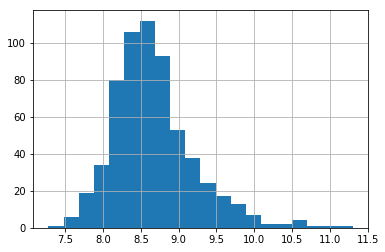
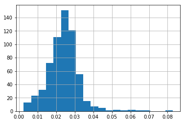
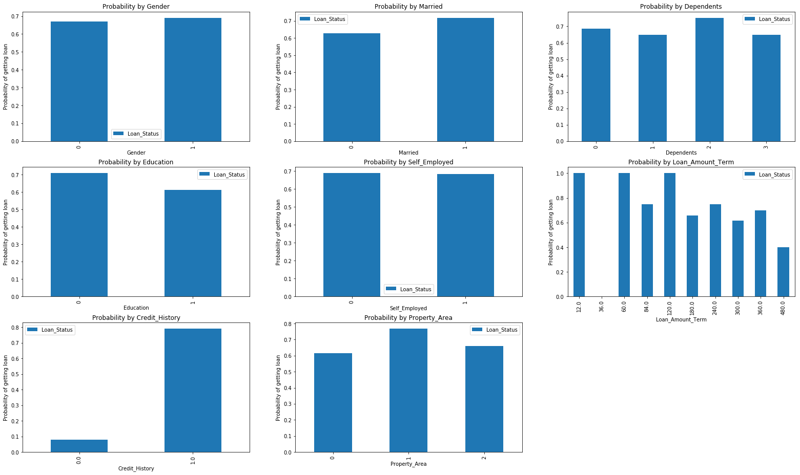
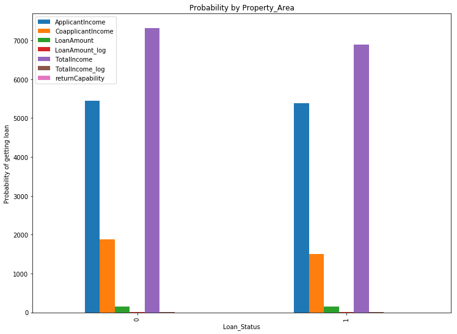

# EX4 Solution

#### import all packages :


```python
% pylab inline
import pandas as pd
import numpy as np
import matplotlib as plt
from sklearn.preprocessing import LabelEncoder
from sklearn.linear_model import LogisticRegression
from sklearn.cross_validation import KFold   #For K-fold cross validation
from sklearn import metrics
from sklearn.naive_bayes import GaussianNB
from sklearn.svm import SVC
from sklearn.neighbors import KNeighborsClassifier
from sklearn.neural_network import MLPClassifier
from sklearn.ensemble import RandomForestClassifier
from sklearn.tree import DecisionTreeClassifier
```

    Populating the interactive namespace from numpy and matplotlib
    

    C:\Users\oleg\Anaconda3\lib\site-packages\IPython\core\magics\pylab.py:160: UserWarning: pylab import has clobbered these variables: ['table']
    `%matplotlib` prevents importing * from pylab and numpy
      "\n`%matplotlib` prevents importing * from pylab and numpy"
    

## data import


```python
df_train = pd.read_csv("./data/train.csv")
df_test = pd.read_csv("./data/test.csv")
```

## cheking & filling missing values


```python
df_train.describe()
```


<div>
<style>
    .dataframe thead tr:only-child th {
        text-align: right;
    }

    .dataframe thead th {
        text-align: left;
    }

    .dataframe tbody tr th {
        vertical-align: top;
    }
</style>
<table border="1" class="dataframe">
  <thead>
    <tr style="text-align: right;">
      <th></th>
      <th>ApplicantIncome</th>
      <th>CoapplicantIncome</th>
      <th>LoanAmount</th>
      <th>Loan_Amount_Term</th>
      <th>Credit_History</th>
    </tr>
  </thead>
  <tbody>
    <tr>
      <th>count</th>
      <td>614.000000</td>
      <td>614.000000</td>
      <td>592.000000</td>
      <td>600.00000</td>
      <td>564.000000</td>
    </tr>
    <tr>
      <th>mean</th>
      <td>5403.459283</td>
      <td>1621.245798</td>
      <td>146.412162</td>
      <td>342.00000</td>
      <td>0.842199</td>
    </tr>
    <tr>
      <th>std</th>
      <td>6109.041673</td>
      <td>2926.248369</td>
      <td>85.587325</td>
      <td>65.12041</td>
      <td>0.364878</td>
    </tr>
    <tr>
      <th>min</th>
      <td>150.000000</td>
      <td>0.000000</td>
      <td>9.000000</td>
      <td>12.00000</td>
      <td>0.000000</td>
    </tr>
    <tr>
      <th>25%</th>
      <td>2877.500000</td>
      <td>0.000000</td>
      <td>100.000000</td>
      <td>360.00000</td>
      <td>1.000000</td>
    </tr>
    <tr>
      <th>50%</th>
      <td>3812.500000</td>
      <td>1188.500000</td>
      <td>128.000000</td>
      <td>360.00000</td>
      <td>1.000000</td>
    </tr>
    <tr>
      <th>75%</th>
      <td>5795.000000</td>
      <td>2297.250000</td>
      <td>168.000000</td>
      <td>360.00000</td>
      <td>1.000000</td>
    </tr>
    <tr>
      <th>max</th>
      <td>81000.000000</td>
      <td>41667.000000</td>
      <td>700.000000</td>
      <td>480.00000</td>
      <td>1.000000</td>
    </tr>
  </tbody>
</table>
</div>


```python
df_train.head()
```


<div>
<style>
    .dataframe thead tr:only-child th {
        text-align: right;
    }

    .dataframe thead th {
        text-align: left;
    }

    .dataframe tbody tr th {
        vertical-align: top;
    }
</style>
<table border="1" class="dataframe">
  <thead>
    <tr style="text-align: right;">
      <th></th>
      <th>Loan_ID</th>
      <th>Gender</th>
      <th>Married</th>
      <th>Dependents</th>
      <th>Education</th>
      <th>Self_Employed</th>
      <th>ApplicantIncome</th>
      <th>CoapplicantIncome</th>
      <th>LoanAmount</th>
      <th>Loan_Amount_Term</th>
      <th>Credit_History</th>
      <th>Property_Area</th>
      <th>Loan_Status</th>
    </tr>
  </thead>
  <tbody>
    <tr>
      <th>0</th>
      <td>LP001002</td>
      <td>Male</td>
      <td>No</td>
      <td>0</td>
      <td>Graduate</td>
      <td>No</td>
      <td>5849</td>
      <td>0.0</td>
      <td>NaN</td>
      <td>360.0</td>
      <td>1.0</td>
      <td>Urban</td>
      <td>Y</td>
    </tr>
    <tr>
      <th>1</th>
      <td>LP001003</td>
      <td>Male</td>
      <td>Yes</td>
      <td>1</td>
      <td>Graduate</td>
      <td>No</td>
      <td>4583</td>
      <td>1508.0</td>
      <td>128.0</td>
      <td>360.0</td>
      <td>1.0</td>
      <td>Rural</td>
      <td>N</td>
    </tr>
    <tr>
      <th>2</th>
      <td>LP001005</td>
      <td>Male</td>
      <td>Yes</td>
      <td>0</td>
      <td>Graduate</td>
      <td>Yes</td>
      <td>3000</td>
      <td>0.0</td>
      <td>66.0</td>
      <td>360.0</td>
      <td>1.0</td>
      <td>Urban</td>
      <td>Y</td>
    </tr>
    <tr>
      <th>3</th>
      <td>LP001006</td>
      <td>Male</td>
      <td>Yes</td>
      <td>0</td>
      <td>Not Graduate</td>
      <td>No</td>
      <td>2583</td>
      <td>2358.0</td>
      <td>120.0</td>
      <td>360.0</td>
      <td>1.0</td>
      <td>Urban</td>
      <td>Y</td>
    </tr>
    <tr>
      <th>4</th>
      <td>LP001008</td>
      <td>Male</td>
      <td>No</td>
      <td>0</td>
      <td>Graduate</td>
      <td>No</td>
      <td>6000</td>
      <td>0.0</td>
      <td>141.0</td>
      <td>360.0</td>
      <td>1.0</td>
      <td>Urban</td>
      <td>Y</td>
    </tr>
  </tbody>
</table>
</div>


```python
missing_values=pd.DataFrame(data=[df_train.apply(lambda x: sum(x.isnull()),axis=0),df_train.apply(lambda x: x.count())],
             columns=df_train.columns,index=['null count','total count'])
print(missing_values.apply(lambda x: sum(x>0),axis=1))
missing_values

```

    null count      7
    total count    13
    dtype: int64
    


<div>
<style>
    .dataframe thead tr:only-child th {
        text-align: right;
    }

    .dataframe thead th {
        text-align: left;
    }

    .dataframe tbody tr th {
        vertical-align: top;
    }
</style>
<table border="1" class="dataframe">
  <thead>
    <tr style="text-align: right;">
      <th></th>
      <th>Loan_ID</th>
      <th>Gender</th>
      <th>Married</th>
      <th>Dependents</th>
      <th>Education</th>
      <th>Self_Employed</th>
      <th>ApplicantIncome</th>
      <th>CoapplicantIncome</th>
      <th>LoanAmount</th>
      <th>Loan_Amount_Term</th>
      <th>Credit_History</th>
      <th>Property_Area</th>
      <th>Loan_Status</th>
    </tr>
  </thead>
  <tbody>
    <tr>
      <th>null count</th>
      <td>0</td>
      <td>13</td>
      <td>3</td>
      <td>15</td>
      <td>0</td>
      <td>32</td>
      <td>0</td>
      <td>0</td>
      <td>22</td>
      <td>14</td>
      <td>50</td>
      <td>0</td>
      <td>0</td>
    </tr>
    <tr>
      <th>total count</th>
      <td>614</td>
      <td>601</td>
      <td>611</td>
      <td>599</td>
      <td>614</td>
      <td>582</td>
      <td>614</td>
      <td>614</td>
      <td>592</td>
      <td>600</td>
      <td>564</td>
      <td>614</td>
      <td>614</td>
    </tr>
  </tbody>
</table>
</div>


we can see that in total the num of missing values is small, so in most columns we will just fill the missing values with the value that appears more often.


```python
df_train['Self_Employed'].fillna('No',inplace=True)
df_train['Loan_Amount_Term'].fillna(360, inplace=True)
df_train['Credit_History'].fillna(1, inplace=True)
df_train['Dependents'].fillna(0, inplace=True)
df_train['Married'].fillna('Yes', inplace=True)
df_train['Gender'].fillna('Male', inplace=True)
```


```python
df_test['Self_Employed'].fillna('No',inplace=True)
df_test['Loan_Amount_Term'].fillna(360, inplace=True)
df_test['Credit_History'].fillna(1, inplace=True)
df_test['Dependents'].fillna(0, inplace=True)
df_test['Married'].fillna('Yes', inplace=True)
df_test['Gender'].fillna('Male', inplace=True)
```

in LoadAmount column we will calculate the median for each of the combinations in 'Self_Employed' and 'Education' columns and fill the LoanAmount accordingly.


```python
table = df_train.pivot_table(values='LoanAmount', index='Self_Employed' ,columns='Education', aggfunc=np.median)
values_to_fill_LA=df_train[df_train['LoanAmount'].isnull()].apply(lambda x: table.loc[x['Self_Employed'],x['Education']], axis=1)
df_train['LoanAmount'].fillna(values_to_fill_LA, inplace=True)
```


```python
table = df_test.pivot_table(values='LoanAmount', index='Self_Employed' ,columns='Education', aggfunc=np.median)
values_to_fill_LA=df_test[df_test['LoanAmount'].isnull()].apply(lambda x: table.loc[x['Self_Employed'],x['Education']], axis=1)
df_test['LoanAmount'].fillna(values_to_fill_LA, inplace=True)

```

## convert all our categorical variables into numeric


```python
df_train.dtypes 
```


    Loan_ID               object
    Gender                object
    Married               object
    Dependents            object
    Education             object
    Self_Employed         object
    ApplicantIncome        int64
    CoapplicantIncome    float64
    LoanAmount           float64
    Loan_Amount_Term     float64
    Credit_History       float64
    Property_Area         object
    Loan_Status           object
    dtype: object


```python
var_mod = ['Gender','Married','Dependents','Education','Self_Employed','Property_Area','Loan_Status']
le = LabelEncoder()
for i in var_mod:
    df_train[i] = le.fit_transform(df_train[i].astype(str))
    
```

do the same for test set


```python
var_mod = ['Gender','Married','Dependents','Education','Self_Employed','Property_Area']
le = LabelEncoder()
for i in var_mod:
    df_test[i] = le.fit_transform(df_test[i].astype(str))
    
```

## now we will normalize,analyze and manipulate the data for best prediction scores

normalizing the LoanAmount column


```python
df_train['LoanAmount_log'] = np.log(df_train['LoanAmount'])

df_test['LoanAmount_log'] = np.log(df_test['LoanAmount'])

```

we will add a column TotalIncome and normalize it by log in column TotalIncome_log


```python
df_train['TotalIncome'] = df_train['ApplicantIncome'] + df_train['CoapplicantIncome']
df_train['TotalIncome_log'] = np.log(df_train['TotalIncome'])
df_train['TotalIncome_log'].hist(bins=20) 

df_test['TotalIncome'] = df_test['ApplicantIncome'] + df_test['CoapplicantIncome']
df_test['TotalIncome_log'] = np.log(df_test['TotalIncome'])
```





another column we like to add is LoanAmount/TotalIncome cause it gives as a clue about the capability of the applicant to return the loan.


```python
df_train['returnCapability'] = df_train['LoanAmount']/df_train['TotalIncome']
df_train['returnCapability'].hist(bins=20) 
```


    <matplotlib.axes._subplots.AxesSubplot at 0x2682063a4a8>





### we will check the realations between our target column and all other columns


```python
import matplotlib.pyplot as plt
fig = plt.figure(figsize=(27,27))

features=['Gender', 'Married', 'Dependents', 'Education',
       'Self_Employed','Loan_Amount_Term', 'Credit_History', 'Property_Area']
for i,feature in enumerate(features):
    temp = df_train.pivot_table(values='Loan_Status',index=[feature],aggfunc=lambda x: x.mean())
    ax = fig.add_subplot(5,3,i+1) # 1x2 grid on the first subplot
    ax.set_xlabel(feature)
    ax.set_ylabel('Probability of getting loan')
    ax.set_title("Probability by %s" % feature)
    temp.plot(kind='bar',ax=ax)


```





```python
import matplotlib.pyplot as plt
fig = plt.figure(figsize=(27,9))
features=['ApplicantIncome', 'CoapplicantIncome', 'LoanAmount','TotalIncome', 
         'TotalIncome_log', 'returnCapability','LoanAmount_log']
# for i,feature in enumerate(features):
#     temp = df_train.pivot_table(values=feature,index=['Loan_Status'])
#     ax = fig.add_subplot(5,3,i+1) # 1x2 grid on the first subplot
#     ax.set_xlabel(feature)
#     ax.set_ylabel('Probability of getting loan')
#     ax.set_title("Probability by %s" % feature)
#     temp.plot(kind='bar',ax=ax)

temp = df_train.pivot_table(values=features,index=['Loan_Status'])
ax = fig.add_subplot(1,2,1) # 1x2 grid on the first subplot
ax.set_xlabel(feature)
ax.set_ylabel('Probability of getting loan')
ax.set_title("Probability by %s" % feature)
temp.plot(kind='bar',ax=ax)
```


    <matplotlib.axes._subplots.AxesSubplot at 0x26820f44438>





## building the predictive model

the next function gets an array of models and list of predictors and prints the accuracy and Cross-Validation Score 
for every combination of model and predictor list.


```python
def classification_model(modelList, data, predictorsList, outcome):
    ans=[]
    for i,model in enumerate(modelList):
        print("Model : ", i+1)
        resList=[]
        for index,predictors in enumerate(predictorsList):
            accuracyAndCV=""
            print("\tchecking for predictors : ",index+1)
            #Fit the model:
            model.fit(data[predictors],data[outcome])

            #Make predictions on training set:
            predictions = model.predict(data[predictors])

            #Print accuracy
            accuracy = metrics.accuracy_score(predictions,data[outcome])
            accuracyAndCV+="Accuracy: "
            accuracyAndCV+=str("{0:.3%}".format(accuracy))
            #print("\tAccuracy : %s" % "{0:.3%}".format(accuracy))
            
            #Perform k-fold cross-validation with 5 folds
            kf = KFold(data.shape[0], n_folds=5)
            error = []
            for train, test in kf:
                # Filter training data
                train_predictors = (data[predictors].iloc[train,:])

                # The target we're using to train the algorithm.
                train_target = data[outcome].iloc[train]

                # Training the algorithm using the predictors and target.
                model.fit(train_predictors, train_target)

                #Record error from each cross-validation run
                error.append(model.score(data[predictors].iloc[test,:], data[outcome].iloc[test]))

            #print("\tCross-Validation Score : %s" % "{0:.3%}".format(np.mean(error)))
            accuracyAndCV+=" CV: "
            accuracyAndCV+=str("{0:.3%}".format(np.mean(error)))
            resList.append(accuracyAndCV)
            #print()
        ans.append(resList)
    return ans
        
```


```python
allvars=['Gender', 'Married', 'Dependents', 'Education',
       'Self_Employed', 'ApplicantIncome', 'CoapplicantIncome', 'LoanAmount',
       'Loan_Amount_Term', 'Credit_History', 'Property_Area','TotalIncome', 
         'TotalIncome_log', 'returnCapability','LoanAmount_log']
```

### cheking feature importance


```python
DTmodel=DecisionTreeClassifier()
RFmodel = RandomForestClassifier(n_estimators=1000)

DTmodel.fit(df_train[allvars],df_train[outcome_var])
RFmodel.fit(df_train[allvars],df_train[outcome_var])

featimp1 = pd.Series(DTmodel.feature_importances_, index=allvars).sort_values(ascending=False)
featimp2 = pd.Series(RFmodel.feature_importances_, index=allvars).sort_values(ascending=False)
print(featimp1)
print(featimp2)

```

    Credit_History       0.292201
    ApplicantIncome      0.156161
    returnCapability     0.118644
    TotalIncome          0.082630
    CoapplicantIncome    0.063993
    TotalIncome_log      0.053880
    Dependents           0.047567
    LoanAmount_log       0.044867
    LoanAmount           0.039744
    Property_Area        0.028626
    Loan_Amount_Term     0.018535
    Married              0.017714
    Self_Employed        0.017172
    Education            0.012203
    Gender               0.006062
    dtype: float64
    Credit_History       0.244875
    returnCapability     0.110894
    TotalIncome_log      0.096910
    TotalIncome          0.095863
    ApplicantIncome      0.094320
    LoanAmount           0.079891
    LoanAmount_log       0.078392
    CoapplicantIncome    0.060914
    Property_Area        0.030750
    Dependents           0.027669
    Loan_Amount_Term     0.025564
    Married              0.016277
    Education            0.014763
    Gender               0.011855
    Self_Employed        0.011064
    dtype: float64
    

combining the plots information and the feature importance we will build some group of features and check them all for some different models


```python
outcome_var = 'Loan_Status'
predictor_var1 = ['Gender', 'Married', 'Dependents', 'Education',
       'Self_Employed', 'Loan_Amount_Term', 'Credit_History', 'Property_Area',
        'LoanAmount_log','TotalIncome_log']
predictor_var2 = ['Credit_History', 'TotalIncome_log', 'LoanAmount_log','Property_Area','Dependents']
predictor_var3 = ['Credit_History', 'TotalIncome_log', 'LoanAmount_log','Property_Area','Education']
predictor_var4 = ['Credit_History', 'TotalIncome_log', 'LoanAmount_log','Property_Area']
predictor_var5 = ['Credit_History', 'TotalIncome_log', 'LoanAmount_log']
predictor_var6 = ['Credit_History', 'TotalIncome_log', 'LoanAmount_log','Married','Dependents']
predictor_var7 = ['Credit_History','ApplicantIncome','returnCapability']
predictorsList=[predictor_var1,predictor_var2,predictor_var3,predictor_var4,predictor_var5,predictor_var6,predictor_var7]
```


```python
model1=SVC(gamma=2, C=1)
model2=SVC(kernel="linear", C=0.025)
model3=GaussianNB()
model4=KNeighborsClassifier(20)
modelsList=[model1,model2,model3,model4]
```


```python
modelsList=[model1,model2,model3,model4]
a=classification_model(modelsList, df_train,predictorsList,outcome_var)
```

    Model :  1
    	checking for predictors :  1
    	checking for predictors :  2
    	checking for predictors :  3
    	checking for predictors :  4
    	checking for predictors :  5
    	checking for predictors :  6
    	checking for predictors :  7
    Model :  2
    	checking for predictors :  1
    	checking for predictors :  2
    	checking for predictors :  3
    	checking for predictors :  4
    	checking for predictors :  5
    	checking for predictors :  6
    	checking for predictors :  7
    Model :  3
    	checking for predictors :  1
    	checking for predictors :  2
    	checking for predictors :  3
    	checking for predictors :  4
    	checking for predictors :  5
    	checking for predictors :  6
    	checking for predictors :  7
    Model :  4
    	checking for predictors :  1
    	checking for predictors :  2
    	checking for predictors :  3
    	checking for predictors :  4
    	checking for predictors :  5
    	checking for predictors :  6
    	checking for predictors :  7
    


```python
pd.DataFrame(data=a,
             columns=['pred1','pred2','pred3','pred4','pred5','pred6','pred7'],
             index=['SVC1','SVC2','GaussianNB','KNeighbors'])
```


<div>
<style>
    .dataframe thead tr:only-child th {
        text-align: right;
    }

    .dataframe thead th {
        text-align: left;
    }

    .dataframe tbody tr th {
        vertical-align: top;
    }
</style>
<table border="1" class="dataframe">
  <thead>
    <tr style="text-align: right;">
      <th></th>
      <th>pred1</th>
      <th>pred2</th>
      <th>pred3</th>
      <th>pred4</th>
      <th>pred5</th>
      <th>pred6</th>
      <th>pred7</th>
    </tr>
  </thead>
  <tbody>
    <tr>
      <th>SVC1</th>
      <td>Accuracy: 90.879% CV: 75.898%</td>
      <td>Accuracy: 84.365% CV: 79.158%</td>
      <td>Accuracy: 82.410% CV: 79.968%</td>
      <td>Accuracy: 82.248% CV: 80.131%</td>
      <td>Accuracy: 81.922% CV: 80.131%</td>
      <td>Accuracy: 82.736% CV: 79.968%</td>
      <td>Accuracy: 96.091% CV: 69.380%</td>
    </tr>
    <tr>
      <th>SVC2</th>
      <td>Accuracy: 80.945% CV: 80.946%</td>
      <td>Accuracy: 80.945% CV: 80.946%</td>
      <td>Accuracy: 80.945% CV: 80.946%</td>
      <td>Accuracy: 80.945% CV: 80.946%</td>
      <td>Accuracy: 80.945% CV: 80.946%</td>
      <td>Accuracy: 80.945% CV: 80.946%</td>
      <td>Accuracy: 80.945% CV: 80.784%</td>
    </tr>
    <tr>
      <th>GaussianNB</th>
      <td>Accuracy: 80.945% CV: 80.460%</td>
      <td>Accuracy: 80.619% CV: 80.621%</td>
      <td>Accuracy: 80.619% CV: 80.621%</td>
      <td>Accuracy: 80.619% CV: 80.621%</td>
      <td>Accuracy: 80.619% CV: 80.621%</td>
      <td>Accuracy: 80.619% CV: 80.785%</td>
      <td>Accuracy: 80.456% CV: 80.296%</td>
    </tr>
    <tr>
      <th>KNeighbors</th>
      <td>Accuracy: 76.221% CV: 72.798%</td>
      <td>Accuracy: 80.293% CV: 78.988%</td>
      <td>Accuracy: 80.782% CV: 80.620%</td>
      <td>Accuracy: 80.782% CV: 80.946%</td>
      <td>Accuracy: 81.107% CV: 80.620%</td>
      <td>Accuracy: 80.293% CV: 79.479%</td>
      <td>Accuracy: 70.358% CV: 66.939%</td>
    </tr>
  </tbody>
</table>
</div>


we can that we got the best results and accuracy-CV relation for (SVC2,pred4) and (KNeighbors,pred4) so thos are the results we going to upload to the competition.


```python
import csv
from itertools import zip_longest

def intoCSV(list1,list2,filename):
    d = [list1, list2]
    export_data = zip_longest(*d, fillvalue = '')
    with open(filename, 'w', encoding="ISO-8859-1", newline='') as myfile:
        wr = csv.writer(myfile)
        wr.writerow(("Loan_ID", "Loan_Status"))
        wr.writerows(export_data)
    myfile.close()
```


```python
loadIdList=df_test['Loan_ID'].tolist()

def transformToYesNo(predictions):
    result=[]
    for i in predictions:
        if i==1:
            result.append('Y')
        else:
            result.append('N')
    return result

def getPred(model,pvars):
    model.fit(df_train[pvars],df_train[outcome_var])
    predictions = model.predict(df_test[pvars])
    predictions=transformToYesNo(predictions)
    return predictions
```


```python
intoCSV(loadIdList,getPred(model2,predictor_var4),'ans1.csv')
intoCSV(loadIdList,getPred(model4,predictor_var4),'ans2.csv')
intoCSV(loadIdList,getPred(model1,predictor_var1),'ans3.csv')
intoCSV(loadIdList,getPred(model3,predictor_var1),'ans4.csv')
```

ans1 and ans2 are the best scores and those are the files we submited.

we also submited some other tries but they weren't successful as ans1 and ans2.
